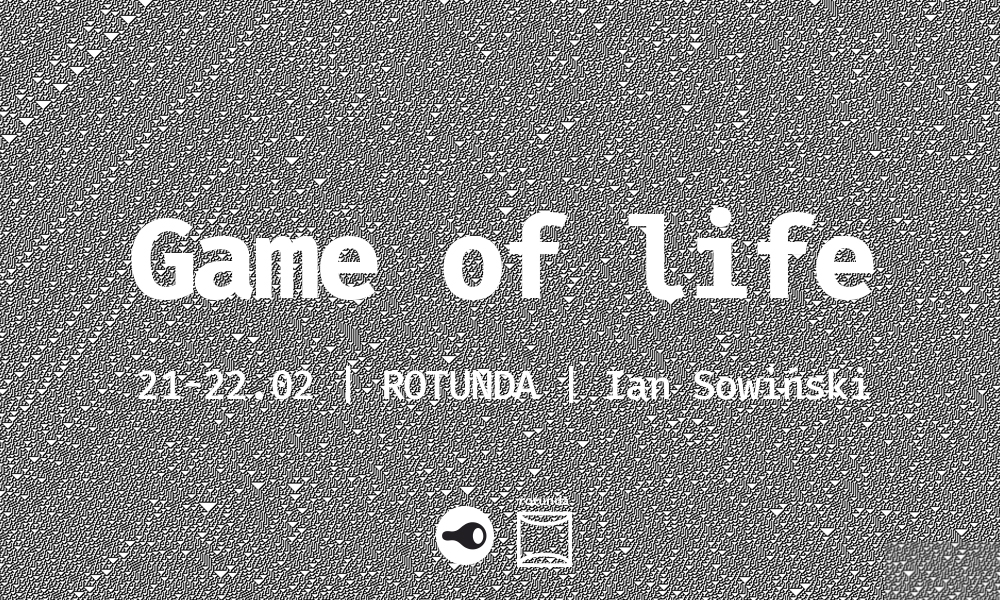

# Game of life*

*Game of life - one of the first and most well known examples of cellular automata, created in 1970 by british mathematician John Conway.

Game was popularized by Martin Gardner on the pages of Scientific American. From time of publication it sored interest because of surprising way, structures can evolve.

Conway's game of life brought attention to cellular autmation among students who treated it as entertainment and among physicists, who paid attention to it's capabilities in area of physical simulators. Today mathematicians, physicists and economists are interested how using only a few simple rules complicated structures are made.

(from Wikipedia, free encyclopedia)

Exhibition will take place in [Rotunda](http://uap.edu.pl/ctg/wystawy/) gallery in Poznań (Poland), beetwen 21-22.02.2017. Meeting with author will take place in Rotunda galery in wensday 22.02.2016 at 18:00.

# Gra w życie*

*Gra w życie - jeden z pierwszych i najbardziej znanych przykładów automatu komórkowego, wymyślony w roku 1970 przez brytyjskiego matematyka Johna Conwaya.

Gra została spopularyzowana przez Martina Gardnera na łamach Scientific American. Od momentu publikacji zawsze wzbudzała duże zainteresowanie z powodu zaskakującego sposobu, w jaki struktury potrafią ewoluować.

To właśnie jej pojawienie się wzbudziło zainteresowanie automatami komórkowymi wśród studentów, którzy traktowali ją jako rozrywkę oraz fizyków, którzy zwrócili uwagę na możliwości automatów w zakresie symulatorów fizycznych. Dzisiaj matematyków, ekonomistów i naukowców z innych dziedzin interesuje sposób, w jaki przy zastosowaniu tylko kilku prostych reguł powstają skomplikowane struktury.

(Wikipedia, otwarta encyklopedia)

Wystawa odbędzie się w galerii [Rotunda](http://uap.edu.pl/ctg/wystawy/) w Poznaniu, w dniach 21-22.02.2017. Spotkanie z autorem odbędzie się w galerii Rotunda w środę 22.02.2016 o godzinie 18:00.

# About instalation

This is my art project on different aspects of reality. Instalation will consist of camera connected to server computer, witch detects the human face onlive, and client raspberry pi computer, connected to thermal printer. 

Thermal printer will print continuously one-dimentional (or two-dimentional if you consider time as second dimention) cellural automata. Printer will work only if server detects human face. Server will be connected to display, so that viewer could have impression of influence on the situation.

There are several philosophical references here - from the idea of deism through observer effect up to AI self-awareness problem.

Work will be exhibited at [Rotunda gallery](http://uap.edu.pl/ctg/wystawy/) (Poznań, Poland) 21-22.02.2017.

**Notes to myself**

[Link to drivers](http://www.logitech.com/pub/video/quickcam/lws220.dmg)

